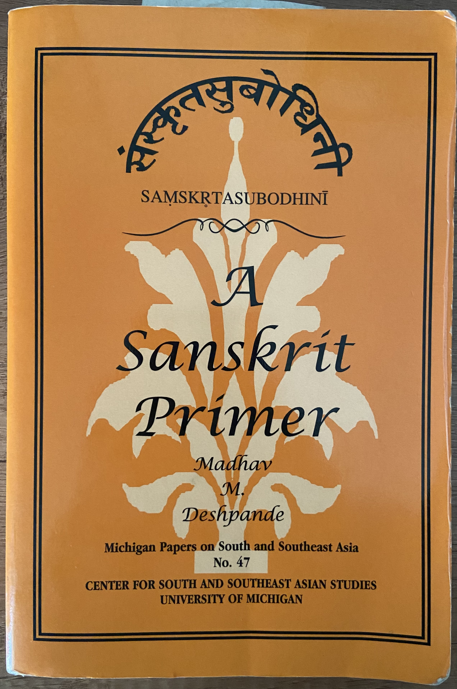

# Introduction

This is my attempt at the translation exercises in the book "Samskrta-Subodhini: A Sanskrit Primer" by Madhav Deshpande. I have tried my best to check for errors but I can't guarantee there are none :-).

**Links to other notes**
1. Back to [My Sanskrit Notes](https://hrishim.github.io/sanskrit_notes/)
1. Translations of lessons in [संस्कृतप्रथमादर्शः Reader - I](https://hrishim.github.io/sanskrit_reader1/reader1/r1_intro.html)

