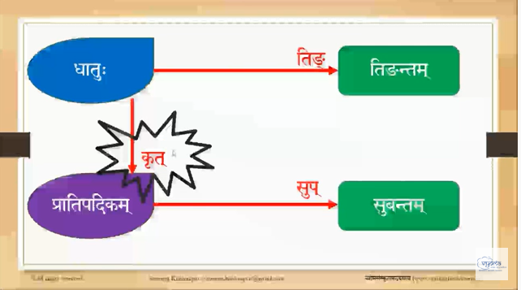

# Kridantas

These notes are from the Vyoma Pathasala [Kridanta](https://www.youtube.com/playlist?list=PLmozlYyYE-ERJj2FfX6WfH5t8i3d2fh1Z) lessons by Dr. Sowmya Krishnapur.

## Lesson 1

### Context

From the [first lesson](https://youtu.be/Vr-5sJXTS_4).

Generally all words (पदम्) are a combination of two components पदम् = प्रकृतिः + प्रत्ययः. Where प्रकृतिः is the root word and प्रत्ययः is the suffix. Both components have their own meanings.

Example: संस्कृतम् = संस्कृत + सुँ

Generally we understand sentences (वाक्य) and words (पद). But to go into a पद we need to know grammar (व्याकरणम्). It is व्याकरण that makes these divisions of प्रकृति and प्रत्यय.

Now संस्कृत can also be separated into two प्रकृति and प्रत्यय.

संस्कृत = सम् सुँ + कृत सुँ

The word कृत can be further divided कृत = कृ + क्त

Generally a पदम् is not just simply one combination of प्रकृति and प्रत्यय. Quite often the प्रकृति can be divided further and further until we get to indivisible components.

**Another example:** वैदेह्याः (from Vaidehi or Vaidehi's - i.e. 6th and 7th विभक्ति)

वैदेह्याः = वैदेही + ङस्

वैदेही = वैदेह + ङीप्

वैदेह = विदेह + अण्

विदेह = वि सुँ + देह ङसिँ

देह = दिह् अच्

So essentially the word वैदेह्याः is formed using two प्रकृतिः  - वि and दिह् and joining them with many प्रत्ययः. Note: I think वि is उपसर्ग. Not sure if that is also a प्रकृतिः.

Generally Sanskrit व्याकरण ज्ञानम् is प्रकृति प्रत्यय ज्ञानम्. The derivation of पदम् from प्रकृति and प्रत्यय is called निष्पत्ति.

**There are only two kinds of words in Sanskrit:**
1. तिङन्तम् (aka क्रिया पदम्)
2. सुबन्तम्

The teacher says "Any word we see in Sanskrit is one of these. Anything is 100% covered as one of these." अव्ययानि अपि सुबन्तानि (avyayas are all *subanthas*).

तिङन्ते धातुः प्रकृतिः तिङ् इति प्रत्ययः अथेव तिङन्तम्। यस्य अन्ते तिङ् प्रत्ययः अस्ति तत् पदम् तिङन्तम् इत्युच्यते।

तिङन्तानि - पठति, पठिष्यति, पठतु etc

**सुबन्ते** प्रातिपदिकम् प्रकृतिः सुप् इति प्रत्ययः। सुप् अन्ते यस्य तत् सुबन्तम्। अतः सुबन्तम् नाम नाम पदम्। *Subanthas* are nouns (adjectives, adverbs also I think).

सुबन्तानि - रामः, रामौ, रामाः etc

**तिङन्तम्** - Verbal forms. It's प्रकृति for this form is called धातु. 

**सुबन्तम्** - Noun forms. It's प्रकृति for this form is called प्रातिपदिकम्।

अतः धातोः तिङ् प्रत्ययस्य योजनेन तिङन्तम् भवति। प्रातिपदिकात् सुप् प्रत्ययस्य योजनेन सुबन्तम् भवति।

धातु examples पठ्, लिख्, वन्द्, नृत् and तिङन्तानि are - पठति, लिखति, वन्दते, नृत्यति

**किन्तु धातुः त्रिविधः भवति -** 

1. **केवलधातुः** - normal simple धातवः like पठ्, लिख्, वन्द्, नृत्। एते केवल धातवः द्विसहस्रं सन्ति (२०००)। धातुपाठे पठिताः २००० धातवः। These are the major root forms of संस्कृतम्. संस्कृते प्रायः सर्वेशाम् अपि शब्दानाम् पदानाम् केवलधातुः एव मूलम्।
2. **सनाद्यन्तधातुः** - चिकीर्ष ति = चिकीर्षति। चिकीर्षति अर्थात् कर्तुम् इच्छति (he wishes to do something). In Sanskrit single words usually cover things like "wishes to read", "wishes to write", "wishes to..." etc. Now चिकीर्षति is not in the list of 2000 केवलधातवः. It is a derived धातु. It can be divided into प्रकृति + प्रत्यय. यः केवल धातुः अस्ति तस्मात् धातोः केचन प्रत्ययाः योज्यन्ते। To the original Dhatus we add some pratyaya's called सनादि। तेषाम् योजनेन पुनः धातु भवति। सनाद्यन्तधातुः = केवलधातुः + णिच्/सन्/यङ्.... Examples: पाठयति, गमयति, नर्तयाति (these are all verbs that show making someone else do the action). These dhatus are formed using णिच् प्रत्यय. Another set - चिकीर्षति (wishes to see), पिपठिष्ति (wishes to read), जिगमिष्ति (wants to go) are formed using सन् प्रत्यय. Yet another set - पुनः पुनः पठति इत्यर्थे पापठयते,  पुनः पुनः वन्दते इत्यर्थे वावन्दते - these are formed using यङ् प्रत्यय. There are a series of *pratyayas* that are used to derive a *dhatu* from *dhatu*.
3. **नामधातुः** - नामपदात् धातुः। From a noun we get a verb using some *pratyayas*. पुत्रीय ति = पुत्रीयति (he who wants to have a son/child). सुबन्तम् + सनादि प्रत्यय (काच्/काम्यच्...). 

**सुबन्तम् are a combination of two components - प्रातिपदिकम् + सुप्**

1. **केवलप्रातिपदिकम्** - Example:  डित्थ + सु = डित्थः. Now डित्थ cannot be broken further. It is a name that does not mean anything. If it is a meaningful name it can be further divided. अव्युत्पन्नानि शब्दस्वरूपाणि - those केवलप्रातिपदिकम् which cannot be further divided. Unlike केवलधातुः there is no list of these words. They are very few.

2. **कृदन्तम्** - It is a kind of nominal stem. E.g. राम + सु = रामः। धातोः कृत् प्रत्ययस्य योजनेन कृदन्तं भवति।

3. **तद्धितान्तम्** - Example: दाशरथि +  सु = दाशरथिः।  तद्धितान्तम् कथं भवति? दशरथ इति सुबन्तम् अस्ति तस्मात् तद्धित इति प्रत्यय भवति तदा प्रातिपदिकम् भवति। तद्धितान्तम् are words that are formed by adding तद्धित प्रत्यय to **subanthas**. You already have a noun (सुबन्तम्) and add this प्रत्यय to form another noun. Examples: कौन्तेय (from कन्तेः), धनवान् (from धनम्->धनवत्->धनवान्), जनता (from जनानाम्)

4. **समासः** - Example: सीतापति सु = सीतापतिः. द्वयोः सुबन्तयोः योजनेन समासः भवति। *Samasa* kind of प्रातिपदिक is derived by joining two *subanthas*. गज + आनन = गजानन, राज्ञः + पुत्रः = राजपुत्रः, राधा + कृष्णः = राधाकृष्णौ

**Summary so far:** The diagram below (concisely and excellently) summarizes the lecture so far.

Words in Sanskrit are of two kinds - तिङन्तम् and सुबन्तम्। धातुः तिङन्तस्य मूलम्। *Dhatu* is the root of *thingantham*. सुबन्तस्य प्रकृतिः प्रातिपदिकम। The root of a *subantham* is *prathipadhikam*. 

धातोः तिङ् प्रतययस्य योजनेन तिङन्तम् भवति। प्रातिपदिकात् सुप् प्रत्ययस्य योजनेन सुबन्तम् भवति। Attaching a *thing-pratyaya* to a *dhatu* makes it a *thingantham*. Attaching a *sup-pratyaya* to a *pratipadikam* makes it a *subantham*. These are the two main words in Sanskrit - verb forms and noun forms.

धातोः कृत् प्रतययस्य योजनेन प्रातिपदिकम् भवति। Adding a *krit pratyaya* converts a *dhatu* to a *pratipadhikam*. A *dhatu* can be converted to another *dhatu* by adding a *sanadhi pratyaya*. सुबन्तात् सनादि प्रत्यय योजनेन अपि धातुः भवति। *Subantha* can be converted to *dhatu* by adding a *sanadhi pratyaya*. सुबन्तात् प्रातिपदिकम् भवति तद्धित प्रत्यय योजनेन। ़From *subantha* adding *thadhita pratyaya* will make it *pratipathikam*. *Samasa* will convert multiple (two or  more) to a *prathipadhikam*.

In the above diagram the red lines achieve inter-conversion. One cannot convert *subanta* directly to *tinganta*. You have to first make it a *dhatu*. Similarly, you can convert a *subanta* to a *pratipadika* and then back to *subanta* to get a new word. A *dhatu* can be converted to another *dhatu* using a *snadaya pratyaya*.

The above covers all words in Sanskrit. Knowing Sanskrit is knowing all the above. There are other things like *Sandhi* etc but they are just changing the letters. Of the above there are three steps which are very basic: *dhatu* -> *pratipadikam*, *dhatu* -> *tingantam* and *pratipadikam*->*subantam*

[This Kridanta](https://www.youtube.com/playlist?list=PLmozlYyYE-ERJj2FfX6WfH5t8i3d2fh1Z) lesson series is about converting *dhatu* -> *pratipadikam* by adding *krt pratyaya* (कृत्). This conversion will give 95% of *pratipadikas* - just an estimate. There is another view - सर्वम् नाम् धातिजमाः - all nouns are from *dhatus*.

Within कृत् प्रत्ययाः there are two categories. One is the *pratyayas* directly given by Panini which we call कृत् प्रत्यय. Panini specifically says this is the *dhatu* and you add this *krit pratyaya* and you get this *pratipadika*. There are also another set of *pratyayas* called उणादि प्रत्यय. They are also added to *dhatus* to get *pratipadikas*. Example: गौः is derived from गम् धातु। गच्छति इति गौः। Derived from गम् + डोस्. Such *pratyayas* (like डोस्) are called उणादि। **Is गो उणादि or डोस्? Later the teacher says गो is उणादि.**

There are two views regarding उणादि - 

1. we accept the derivation of उणादि from *dhatu* then 100%, or at least 99% of *pratipadikas* will be derived from *dhatus*. 
2. those that consider उणादि as something that cannot be split further - meaning they take गो as something that cannot be divided - say that there is a set of केवल प्रातिपतिकः that cannot be split further. Most words come from *dhatus* and a smaller set come from *kevala pratipadikam*.

**Start from 35:20**
