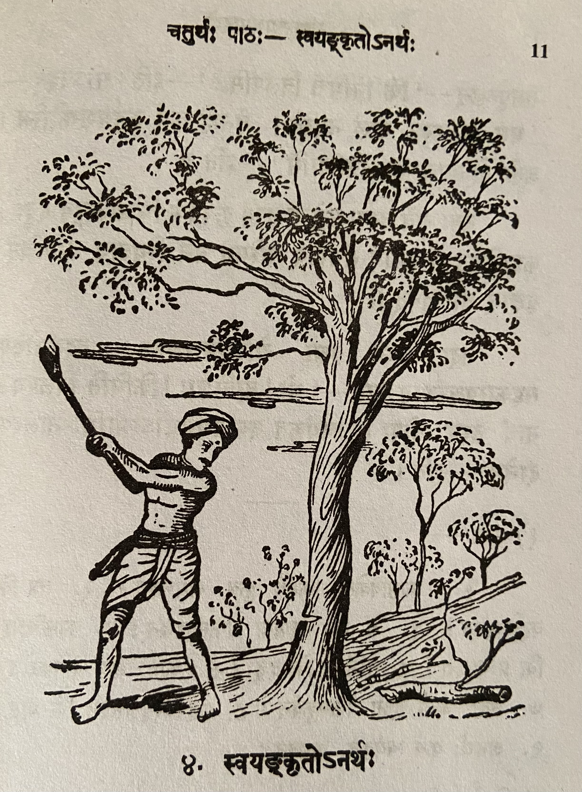

# Lesson 4: स्वयङ्कृतोऽनर्थः

जातु काष्टविक्रेता कश्चित् काष्ठार्थं वनमगच्छत्। तत्र स क्कचिदासीनः परितो विलोक्य विलपितुमारभत। तं विलपन्तं वीक्षय तस्मिन् वने स्थितास्तरवः करुणया तमपृच्छन् - ’किं निमित्तं विलपसि?’ - इति॥ सोऽवदत् - ’मम कुठारस्य नालं नास्ति। तेनाहं कर्म कर्तुमशक्तोस्मि। अतो भोज्यालाभात् विलपामि’ - इति॥

ततः सर्वे तरवः समेत्य तस्मै कृपयैकं चिञ्चालगुडं ददुः। काष्ठच्छित् तं कुठारे संयोज्य तस्मिन् वने स्थितान् कतिचित् वृक्षान् अच्छिनत्।

तदा अन्ये वृक्षा रोदितुमासभन्त। तदवलोक्य सहकारवृक्षस्तान् प्राह - ’भो! बालिशाः किमिति विलपथ? नायं तस्य दोषः। स्वयंकृत एवायमनर्थोऽस्माभिः नालस्य दानेन’ - इति।

---

**Translation**

---

**Vocabulary**

| Word | Meaning | Word | Meaning |
| --- | --- | --- | --- |
| जातु *in.* | once | भोज्य *n.*| food |
| काष्टविक्रेतृ *m.* | a wood seller | चिञ्चालगुड *m.* | a stick of the tamarind tree |
| काष्टार्थम् *in.* | for wood | काष्ठच्छित् *m.* | wood cutter |
| आसीन *a , m* | sitting | अच्छिनत् P. | cut |
| परितः *in* | all around | सहकारवृक्षः *m.* | a mango tree |
| विलपितुम् *in* | to weep | पादप *m.* | tree |
| कुठार *m.* | an axe | वालिश *m.* | foolish |
| नाल *n.* | handle |
