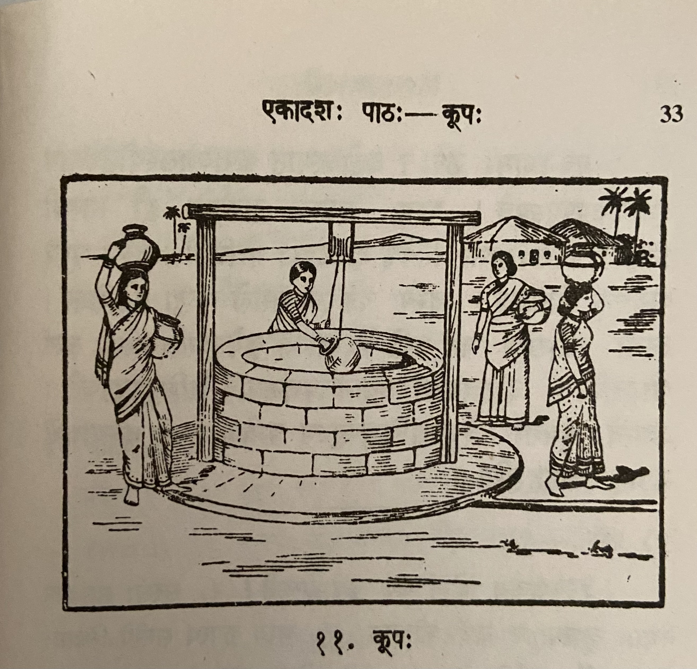

# Lesson 11: कूपः

अयं समणीयः कूपः। पानाय योग्यं जलं कूपे लभ्यते। सरसो जलं स्नानेेन मलिनं भवति। नद्याः सलिलं प्रकृत्यैव कलुषम्। समुद्रस्य वारि लवणम्। कूपस्य उदकम् अनाविलं पानयोग्यं च भवति॥

चित्र> पश्य। कूपस्य समन्तात् बहूनि सन्ति क्षेत्राणि। ततो नातिदूरे दृश्यन्ते कतिचन गृगाणि। तेषु गृहेषु वसन्त्यः स्त्रियः अस्मात् कूपाज्जलमं नयन्ति॥

अस्य कूपस्य समीपे चतस्रः स्त्रियः सन्ति। द्वे स्त्रियौ जलघटं शिरसि निधाय गच्छतः। अपरा कूपाज्जलमुद्धरति। अन्या जलमुद्धर्तुं घटहस्ता तिष्ठति॥

अयमगाधः कूपः। अतोऽस्मात् कूपाज्जलस्योद्धरणाय दारुचक्रमुपयूज्यते। पश्य, कूपस्य पार्श्वयोः द्वौ स्तम्भौ निखातौ। तयोरुपरि तिर्यक् दारुदण्डो योजितः। तस्य मध्ये दारुचक्रं पिनद्धम्। तस्य चक्रस्यान्तराले रज्जुः प्रवेशिता। तस्या रज्जोरग्रेण घटं कण्ठे बद्ध्वा तं कूपेऽवतारयन्ति, जलं चोद्धरन्ति। दारुचक्रस्य स्थानेऽयश्चक्रमपि कैश्चिदुपयुज्यते। अद्यत्वे भूयसा वैद्युतशक्तिमुपयुज्य यन्त्रेण जनाः कृष्याद्यर्थे कूपात् जलमुद्धरन्ति॥