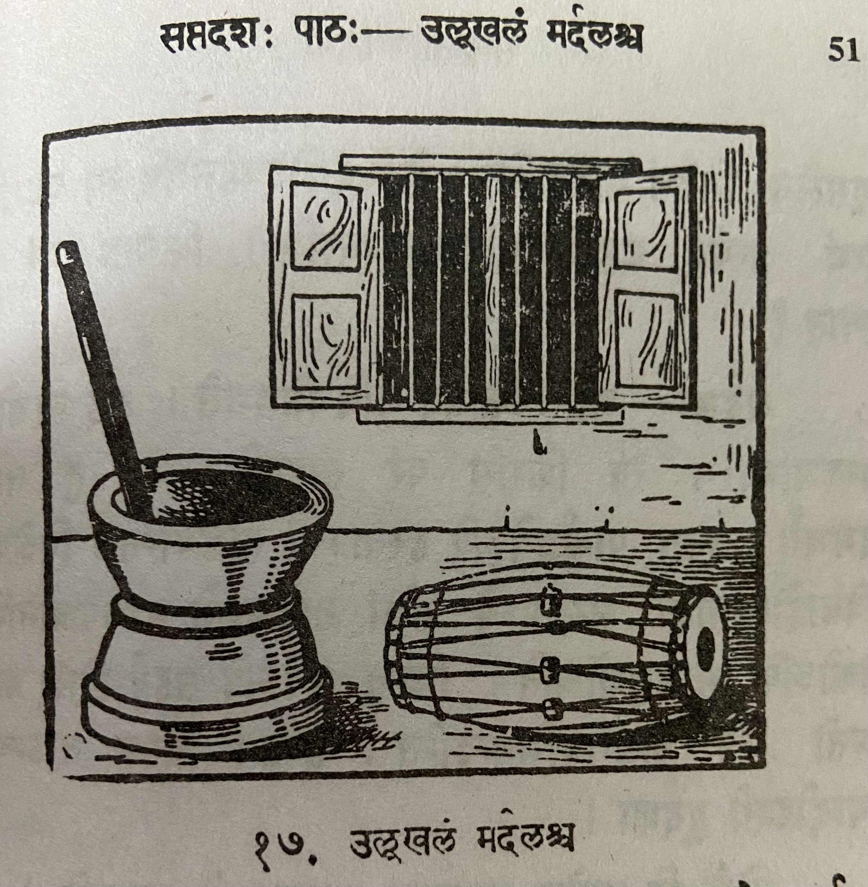

# Lesson 17: उल्लूखलं मर्दलश्च

कस्मिश्चित् गृहे भजनोत्सवानन्तरं रात्रौ मर्दलः कश्चिदुलूखलस्य समीपे स्थापितः।  मित्रमन्तिके दृष्टवा मर्दलः कुशलं पृच्छंस्तेन सह सम्भाषते।

मर्दलः - सखे! अपि कुशलं भवतः? अस्मिन् देशे का वार्ता?

उलूखलम् - मित्र? अस्मिन् देशे मां विहाय सर्वेऽपि कुशलिन एव। अहं परं मन्दभाग्यम्।

मर्दलः - कुतस्त्वं मन्दभाग्यम्? कस्ते दुःखहेतुः?

उलूखलम् - सखे! किं ब्रवीमि। तथापि श्रूयताम् - दुर्भगस्य मे शिरसि धान्यानि निधाय स्त्रियः पुरुषाश्च मां मुसलेन निर्दयं ताडयन्ति। केचिदयोदण्डेनापि मां प्रहरन्ति इत्थं प्रत्यहं महती पीडामनुभवामि। किमतः परं कष्टं स्यात्?

मर्दलः - भद्र! किमिदं मयि निवेद्यते। अहं त्वक्तोऽपि मनदभाग्यः। त्वं शिरसि परं ताड्यसे। मां तु तादने समर्थाः जनाः पार्श्वद्वयेऽपि हस्ताभ्यां ताडयन्ति। विशेषतश्च विवाहोत्सवादौ सभामध्ये तीव्रं ताडयन्तो मामवजानन्ति। नैकोऽपि मामनुसौचति। किन्तु किन्तु सर्वेऽपि सहर्षं शिरः कम्पयन्तो मम ताडनमभिनन्दन्ति। हन्त! कस्य वाऽन्यस्य स्यादीदृशी दुर्दशा।

लोके हि प्रायेण नान्यस्य दुःखमन्यो जानाति॥

---

## Translation

**Title:** The mortar (उलूखलम्) and (च) the drum (मर्दलः) (i.e. percussion instrument) 

In some (कस्मिश्चित्) house (गृहे) after (अनन्तरं) a devotional music (भजन) festival (उत्सव) in the night (रात्रौ) a drum (मर्दलः) was placed (स्थापितः) close to (समीपे) some (कश्चिद्) mortar (उलूखलस्य).

Drum (मर्दलः) - Oh friend (सखे)! Are (अपि1) you (भवतः) well/fine (कुशलं)?

1अपि usually means "also". But it is used in sentences that are questions similar to usage of वा. अपि कुशलम् is the same as कुशलं वा

---

## Vocabulary

| Word | Meaning | Word | Meaning |
| --- | --- | --- | --- |
| उलूखल *n.* | wooden mortar used for cleansing rice (removing husk) | मुसल *m. n.* | pestle| 
| कुशल *n.* | welfare | अयोदण्ड *m.* | an iron-bar |
| दुर्भग *a. m.* | unfortunate | प्रवृत्ति *f.* | news|
| वृत्तान्त *m* | news | | |

The word भवति means "to be". Its root is भू. When a prefix (उपसर्ग) is added to भवति its meaning changes.

| Word | Meaning | Word | Meaning |
| --- | --- | --- | --- |
| अनुभवति | enjoys, experiences | परिभवति | disregards |
| पराभवति | overcomes | प्रभवति | Is able to, happen, prevail |
| सम्भवति | happens | अभिभवति | defeats |