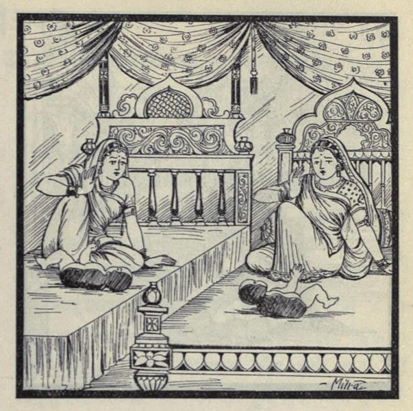

# Lesson 24: जरासन्धः

पुरा किल1 वृहद्रथो नाम मगधानां राजा बभूव। स काशिराजस्य द्वे अपि सुते पर्यणयत्। महताऽपि कालेन तस्य वंशकरः सुतो नाजायत। अतः स राट् भृशं दुःखितो राज्यं परित्यज्य भार्याभ्यां सः तपोवनमगच्छत्॥

तत्र चण्डकौशिको नाम मुनिः सभार्य तम् तपसि निरतमपश्यत्। अपृच्छच्च तं तपसः कारणम्। पार्थिवश्चात्मनः सन्ततेरभावं कारणं व्यज्ञापयत्॥

तन्निशम्य सत्यवाक् स महर्षिः आम्रफलमेकं तस्मै दत्त्वा जगाद - ’इदं फलं सन्ततिं दास्यति। निवर्तस्व। अलं क्लेशकारिणा तपसा’ - इति।

तदादाय प्रहृष्टो नृपः पत्नीभ्यां सहितः स्वपुरम् आजगाम। आगत्य च ताभ्यां तत्फलं प्रायच्छत्। ते उमे अपि तत् फलं द्विधा विभज्य तमभक्षयताम्। कालेनैका सजीवं शरीरार्धं प्रासूत, अपरा चापरमर्धम्। भीता धात्री ते अर्धे वनं नीत्वा ????

---

**Translation**

In ancient times (पुरा) a king (राजा) named (नाम) Vrihadratha (वृहद्रथः) was there (बभूव). He (सः) also (अपि) married (पर्णयत्) the king of Kashi's (काशिराजस्य) two (द्वे) daughters (children) (सुते). Even (अपि) after a long (महता) time (कालेन) a son (वंशकरः सुतः) was not (न) born (अजायत). Therefore (अतः) the (सः) king (राट्) was very (भृशम्) unhappy (दुःखितः), giving up (परित्यज्य) (his) kingdom (राज्यम्) he (सः) went to (अगच्छत्) a sacred grove (तपोवनम्).

1किल does not have a direct English translation. In Tamizh it is அல்லவோ.

There (तत्र) a sage (मुनिः) named (नाम) *Chandakoushika* (चण्डकौशिकः) saw  (अपश्यत्) him (तम्) with his wife (सभार्यम्) engaged (निरतम्) in penance (तपसि). And (च) Asked (अपृच्छच्त्) him (तम्) the reason (कारणम्) for the penance (तपसः). The king (पार्थिवः) informed (व्यज्ञापयत्) (the sage) about his (आत्मनः) lack of (अभावम्) a son (सन्ततेः)

---

**Notes and Vocabulary**

तपोवनम् - sacred grove, a place frequented by ascetics 