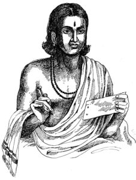

# Lesson 27: महाकविः श्रीकालिदासः

पुरा भोजस्य राज्ञः सभायां परश्शता कवयोऽभवन्। तेषामेकः कालिदासो नाम। कालिदासः प्रतिभया सर्वानन्यान् कवीनत्यशेत तेन भोजराजस्य तस्मिन् महानादरः। तमेव स कवीनां चक्रवर्तिनममन्यत॥

इतरे कवयः तदसहमानाः परोक्षे भोजं राजानमनिन्दन्। अयं वृत्तान्तः कथञ्चित भोजस्य कर्णमागतः।

एकस्मिन्नहनि राजा सर्वान् कवीनाहूय ’क-ख-ग-घ’ इत्येतां ’समस्यां’ दत्वा तानब्रवीत् - ’यः समस्यामिमं पूरयिष्यते स एव कवीनां चक्रवर्ती भविष्यति’ इति। एवमुक्तवा तान् विससर्ज॥

गृहमेत्य सर्वे कवयः सर्वान् व्यापारान् परित्यज्य समस्यायाः पूरणे निरता बभूवुः। परमैकोपि समस्याम् पूरयितुं शशाक। परेद्युस्ते राजसभामेत्य म्लानमुखाः तस्थुः॥

कालिदासस्तु सभां प्रति चलन् मार्गे तालपत्रमयं पुस्तकमादाय पाठशालां गच्छनतीं बालिकामपश्यत्। सा च तं दृष्ट्वा सविनयं प्रणनाम। तेन तस्यां प्रीतः कविः तया सह सँल्लपति - 

कालिदासः - का त्वम् बाले?

बालिका - काञ्चनमाला।

कालिदासः - कस्याः पुत्री?

बालिका - कनकलतायाः

कालिदासः - हस्ते किम ते?

बालिका - तालीपत्रम्।

कालिदासः - का वा रेखा?

बालिका - क-ख-ग-घ॥

तया सहैवं सँल्लप्य कालिदासः सभामागच्छत्। ततो राजा प्राह - ’भो भोः कबयः! कवयः! पठ्यतां यदि पूरिता समस्या’। सर्वे निर्वचना अधोमुखाः स्थिताः। अथ कालिदासः पीठादुत्थाय व्यजिज्ञापत् - ’राजन् मया पूरिता समस्या।’ राजा प्राह - ’पठ्यताम्’ कालिदासः पठति -

का त्वं बाले? काञ्चनमाला

कस्याः पुत्री? कनकलतायाः।

हस्ते किं ते? तालीपत्रं

का वा रेखा - क-ख-ग-घ॥

श्लोकमिमं श्रुत्वा सर्वेऽपि कवयः त्यक्तमत्सराः कालिदासमेव कवीनां सार्वभौममन्वमन्यन्त॥

---

**Translation**

In olden days (पुरा) in the assembly (सभायाम्) of king (राज्ञः) Bhoja (भोजराजस्य) there were (अभवन्) more than a hundred (परसश्शता) poets (कवयः). Of them (तेषाम्) one (एकः) named (नाम) *Kalidasa* (कालिदास). Kalidasa's (कालिदासः) genius (प्रतिभया) exceeded (अत्यशेत) other poets (कवीन्) due to that (तेन) King Bhoja (भोजराजस्य) had great respect (महानादरः) for him (तस्मिन्). He (तम्) only (एव) is the emperor (चक्रवर्तिनम्) of the poets (कविनाम्) thought (अमन्यत)॥

Other (इतरे) poets (कवयः) not tolerating (असहमानाः) that (तत्) indirectly (परोक्षे) ridiculed (अनिन्दन्) King Bhoja (भोजम् राजानम्). 

---

**Notes and Vocabulary**

| Word | Meaning | Word | Meaning | Word | Meaning |
| --- | --- | --- | --- | --- | --- |
| परश्शताः *a. m.* | more than a hundred | परेद्युः *in* | next day | प्रतिभा *f* | genius |
| अत्यशेत *A* | excelled | तालीपत्रमय *a* | consisting of palm leaves | म्लानमुखाः *a. m.*  | with their dejected faces |
| चक्रवर्ती *m* | an emperor | परोक्षे *in* | behind one's back | निर्वचनाः *a. m.* | without words |
| समस्या | part of a stanza given to be completed | व्यापार *m* | engagement | त्यक्तमत्सर *a. m.* | giving up envy |